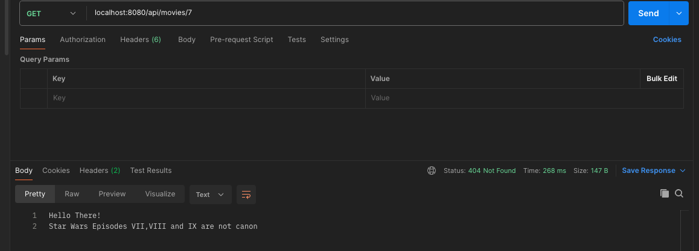
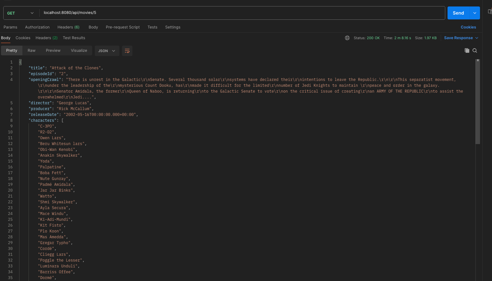
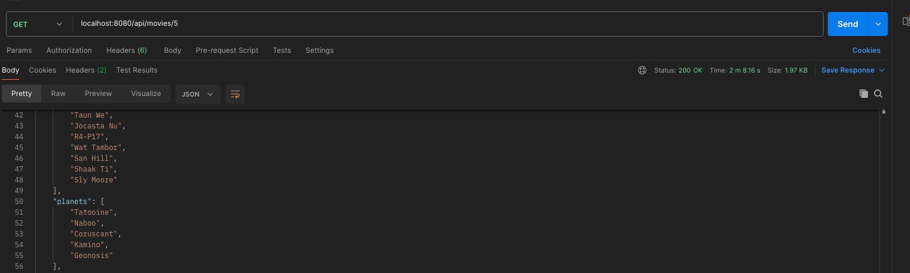
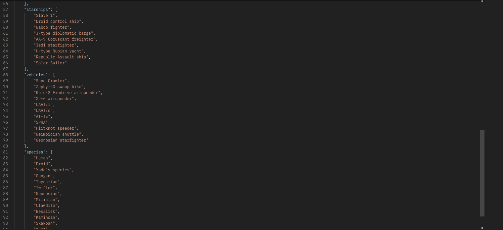

# Starwars-project
this API microservice is made of 3 endpoints that consumes from StarWars API https://swapi.dev/ and uses their information
for the following enpoints.

to see the code documentation of this microservice, use the mvn javadoc:javadoc and then go to target/site/apidocs/index.html
### Endpoint 1: getMovieData.

this endpoint is conformed from the following path("/api/movies/{movieId}") where movieID is an Integer Number with a range from 1-9, if the user selects a number from 1-6, it will return the StarWars movie episode information associated with that movie id.

| Movie Episode Title | Associated Movie ID |
|---------------------|---------------------|
| EPISODE IV          | 1                   |
| EPISODE V           | 2                   |
| EPISODE VI          | 3                   |
| EPISODE I           | 4                   |
| EPISODE II          | 5                   |
| EPISODE III         | 6                   |

if the user selects episode VII,VIII OR IX, a custom exception will be thrown with a message to the end user, informing him that the sequels are not canon

The response Object is made with this Parameters.
-  private String title;
-  private String episodeId;
-  private String openingCrawl;
-  private String director;
-  private String producer;
-  private Date releaseDate;
-  private List<String> characters;
-  private List<String> planets;
-  private List<String> starships;
-  private List<String> vehicles;
-  private List<String> species;
-  private Date created;
-  private Date edited;

API Response:

